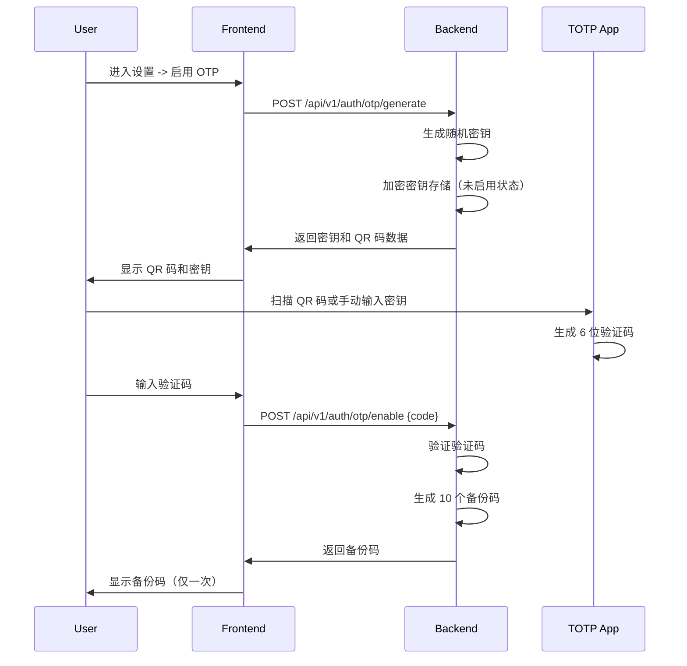
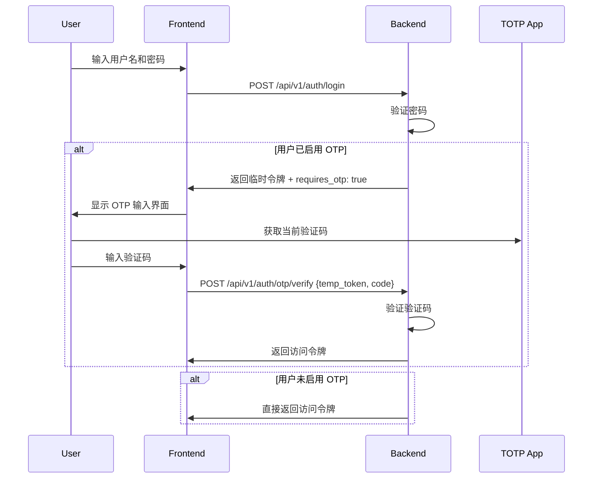
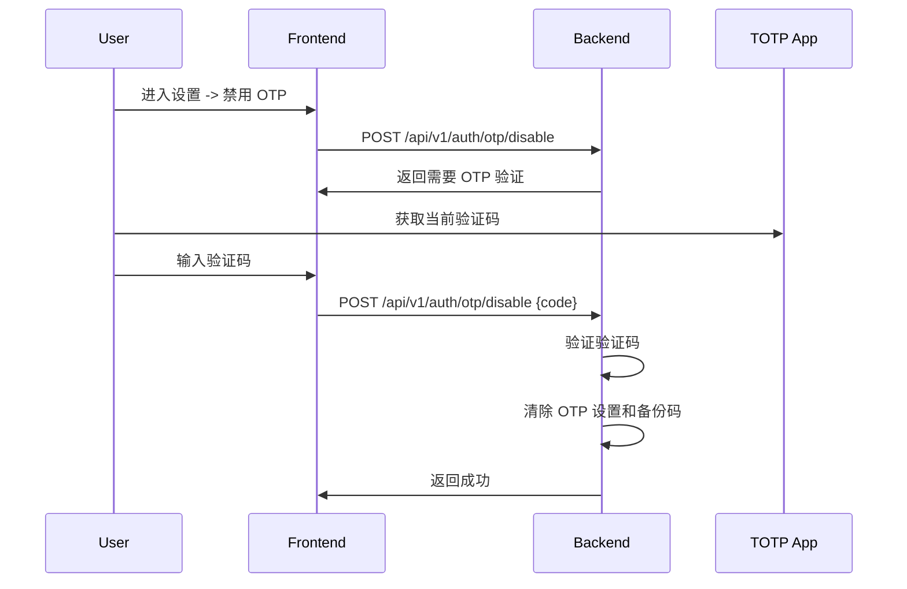

# OTP 二次验证设计文档

## 概述

为系统增加基于 TOTP (Time-based One-Time Password) 的二次验证功能，使用手机移动 app（如 Google Authenticator、Authy 等）提供的动态验证码。

## 验证流程

### 1. 启用 OTP 流程



### 2. 登录验证流程



### 3. 禁用 OTP 流程



## 数据库模型

### 用户表扩展

```sql
ALTER TABLE users ADD COLUMN otp_secret TEXT;           -- 加密的 OTP 密钥
ALTER TABLE users ADD COLUMN otp_enabled BOOLEAN DEFAULT false;  -- OTP 是否启用
ALTER TABLE users ADD COLUMN otp_backup_codes TEXT;      -- JSON 数组，存储备份码
ALTER TABLE users ADD COLUMN temp_otp_token TEXT;        -- 登录时的临时令牌
ALTER TABLE users ADD COLUMN temp_otp_token_expires_at DATETIME;  -- 临时令牌过期时间
```

### 备份码结构

```json
["ABCD1234", "EFGH5678", "IJKL9012", "MNOP3456", "QRST7890",
 "UVWX1234", "YZAB5678", "CDEF9012", "GHIJ3456", "KLMN7890"]
```

## API 接口设计

### 1. 生成 OTP 密钥

```
POST /api/v1/auth/otp/generate
Authorization: Bearer <access_token>

Response:
{
  "code": 0,
  "message": "success",
  "data": {
    "secret": "JBSWY3DPEHPK3PXP",  -- Base32 编码的密钥（明文，仅显示一次）
    "qr_code": "data:image/png;base64,..."  -- QR 码图片（base64）
  }
}
```

### 2. 启用 OTP

```
POST /api/v1/auth/otp/enable
Authorization: Bearer <access_token>
Content-Type: application/json

Request:
{
  "code": "123456"  -- 6 位验证码
}

Response:
{
  "code": 0,
  "message": "success",
  "data": {
    "backup_codes": ["ABCD1234", "EFGH5678", ...]  -- 10 个备份码
  }
}
```

### 3. 禁用 OTP

```
POST /api/v1/auth/otp/disable
Authorization: Bearer <access_token>
Content-Type: application/json

Request:
{
  "code": "123456"  -- 6 位验证码
}

Response:
{
  "code": 0,
  "message": "success"
}
```

### 4. 验证 OTP（登录）

```
POST /api/v1/auth/otp/verify
Content-Type: application/json

Request:
{
  "temp_token": "eyJhbGciOiJIUzI1NiIsInR5cCI6IkpXVCJ9...",  -- 登录返回的临时令牌
  "code": "123456"  -- 6 位验证码
}

Response:
{
  "code": 0,
  "message": "success",
  "data": {
    "access_token": "...",
    "refresh_token": "...",
    "expires_in": 86400,
    "user": { ... }
  }
}
```

### 5. 获取备份码

```
GET /api/v1/auth/otp/backup
Authorization: Bearer <access_token>

Response:
{
  "code": 0,
  "message": "success",
  "data": {
    "backup_codes": ["ABCD1234", "EFGH5678", ...]
  }
}

注意：此接口只能在启用 OTP 后调用一次，之后返回已获取过的备份码列表（已使用的标记）
```

## 技术实现

### TOTP 算法

使用 `github.com/pquerna/otp/totp` 库：

```go
import "github.com/pquerna/otp/totp"

// 生成密钥
key, _ := totp.Generate(totp.GenerateOpts{
    Issuer:      "OpenClusterClaw",
    AccountName:  username,
    SecretSize:   32,
})

// 验证码
valid, _ := totp.Validate(code, secret)

// QR 码生成
qrCode, _ := key.Image(256, 256)
```

### 密钥加密

使用 AES-256-GCM 加密存储密钥：

```go
import "crypto/aes"
import "crypto/cipher"
import "crypto/rand"

// 加密
func encryptSecret(plaintext, key []byte) ([]byte, error) {
    block, _ := aes.NewCipher(key)
    gcm, _ := cipher.NewGCM(block)
    nonce := make([]byte, gcm.NonceSize())
    rand.Read(nonce)
    return gcm.Seal(nonce, nonce, plaintext, nil), nil
}
```

### 备份码生成

```go
func generateBackupCodes(count int) []string {
    codes := make([]string, count)
    for i := 0; i < count; i++ {
        b := make([]byte, 4)
        rand.Read(b)
        codes[i] = strings.ToUpper(hex.EncodeToString(b))
    }
    return codes
}
```

## 安全考虑

1. **密钥加密存储**：OTP 密钥必须加密后存储，使用环境变量中的加密密钥
2. **QR 码仅在生成时显示**：QR 码和明文密钥只显示一次
3. **备份码显示**：备份码仅在启用成功后显示一次，之后标记为已使用
4. **临时令牌**：登录时如果需要 OTP，返回短期有效的临时令牌（5分钟）
5. **速率限制**：OTP 验证失败多次后暂时锁定账户
6. **验证码时间窗口**：允许前后 1 个时间窗口（30秒）的验证码

## 前端界面设计

### 个人设置页面

```
┌─────────────────────────────────────────────┐
│  个人设置                                  │
├─────────────────────────────────────────────┤
│                                             │
│  二次验证 (2FA)                              │
│  [ ] 启用 OTP 验证                           │
│                                             │
│  状态: 已启用                               │
│                                             │
│  [查看备份码] [禁用 OTP]                      │
│                                             │
└─────────────────────────────────────────────┘
```

### 启用 OTP 流程

```
┌─────────────────────────────────────────────┐
│  启用二次验证                                │
├─────────────────────────────────────────────┤
│                                             │
│  1. 使用 Google Authenticator 等应用扫描下方 QR 码  │
│                                             │
│        [ QR CODE ]                          │
│                                             │
│  2. 或手动输入密钥:                          │
│  [ JBSWY3DPEHPK3PXP ]                       │
│                                             │
│  3. 输入应用显示的验证码:                     │
│  [ ________ ]                               │
│                                             │
│  [验证并启用]                                │
│                                             │
└─────────────────────────────────────────────┘
```

### 登录 OTP 输入

```
┌─────────────────────────────────────────────┐
│  Open Cluster Claw                          │
├─────────────────────────────────────────────┤
│                                             │
│  输入验证码                                 │
│                                             │
│  [ ________ ]                               │
│                                             │
│  验证码来自您的 Authenticator 应用              │
│                                             │
│  [验证]                                     │
│                                             │
└─────────────────────────────────────────────┘
```

### 备份码显示

```
┌─────────────────────────────────────────────┐
│  备份码                                     │
├─────────────────────────────────────────────┤
│                                             │
│  请保存以下备份码，当无法使用 Authenticator    │
│  时可以使用这些代码登录。每个代码只能使用一次。  │
│                                             │
│  1. ABCD1234  [复制]                        │
│  2. EFGH5678  [复制]                        │
│  3. IJKL9012  [复制]                        │
│  ...                                        │
│  10. KLMN7890  [复制]                       │
│                                             │
│  [下载] [关闭]                               │
│                                             │
└─────────────────────────────────────────────┘
```

## 环境变量

```bash
# OTP 密钥加密密钥（必须设置）
OTP_ENCRYPTION_KEY=your-32-byte-encryption-key-here

# OTP 验证时间窗口（秒）
OTP_TIME_WINDOW=30
```

## 实现优先级

1. **P0**: TOTP 服务端逻辑和数据模型
2. **P0**: 生成密钥和启用/禁用 OTP API
3. **P1**: 登录流程中的 OTP 验证
4. **P1**: 前端 OTP 设置界面
5. **P2**: 备份码功能
6. **P2**: 前端登录 OTP 输入界面
